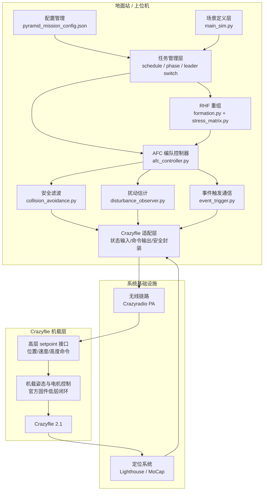
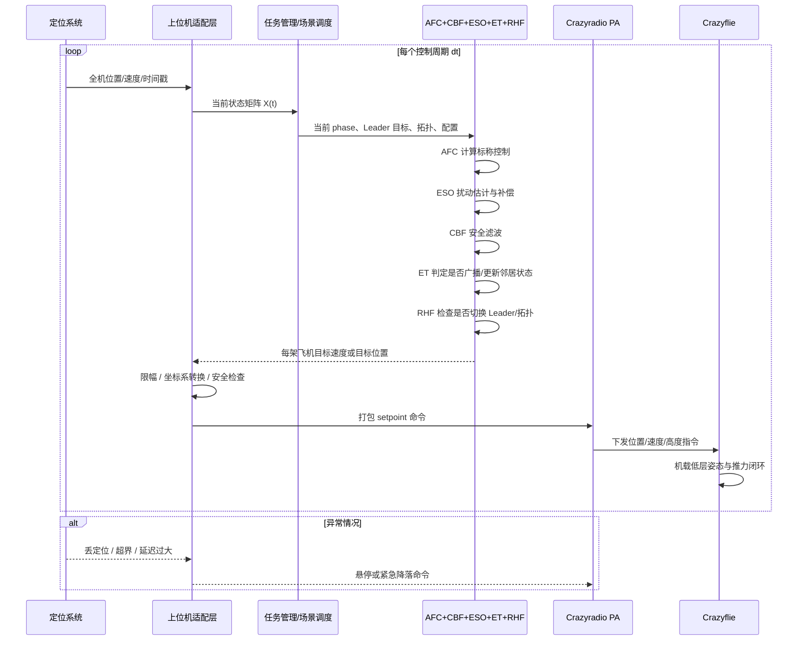

# Crazyflie 算法接入模块图与数据流图

最后更新：2026年3月6日

本文档用于说明当前 AFC 仿真框架如何与 Crazyflie 真机系统结合，重点回答两件事：

1. 算法模块应该放在哪一层运行。
2. 定位、控制、通信、机载飞控之间的数据如何流动。

---

## 一、模块图



### 模块图说明

- 当前仓库中的 AFC、CBF、ESO、ET、RHF 更适合放在地面站或上位机运行，而不是第一步就移植到 Crazyflie 板载 MCU 上。
- Crazyflie 机载侧保留官方固件已有的低层姿态和推力控制闭环。
- 你的算法主要负责在每个控制周期计算“每架飞机接下来该去哪里”，通常输出为位置参考或速度参考。
- 适配层负责把仿真代码里的状态矩阵和控制输出转成真机系统能直接使用的接口格式。

---

## 二、数据流图



### 数据流图说明

- 定位系统输出的是全机状态，不是仿真积分出来的虚拟状态。
- 上位机适配层需要把真机坐标、时间戳、飞机 ID 整理成算法所需的状态矩阵。
- 任务管理层负责 phase 切换、Leader 参考、拓扑更新和参数读取。
- 控制层内部可以按当前仓库结构串联 AFC、ESO、CBF、ET 和 RHF。
- 输出阶段不建议第一步直接发加速度指令，更建议先发速度参考或位置参考，因为这和现有 Crazyflie 高层控制接口更容易对接。

---

## 三、与当前代码的对应关系

| 真机接入层 | 当前仓库模块 | 作用 |
|------------|--------------|------|
| 场景/任务管理 | src/main_sim.py | 维护综合任务、phase、Leader 切换和统一场景定义 |
| 标称编队与拓扑 | src/formation.py, src/stress_matrix.py | 生成编队、应力矩阵、稀疏图和 RHF 相关拓扑 |
| 编队控制器 | src/afc_controller.py | 根据当前位置和 Leader 参考计算控制输入 |
| 安全层 | src/collision_avoidance.py | 在控制输出外增加 CBF 安全滤波 |
| 鲁棒层 | src/disturbance_observer.py | 估计扰动并做补偿 |
| 通信层 | src/event_trigger.py | 管理事件触发和广播更新逻辑 |
| 参数管理 | pyramid_mission_config.json | 保存综合任务默认参数 |

---

## 四、实际落地建议

建议按以下顺序接入 Crazyflie 系统：

1. 先做单机链路打通，只验证定位读取和 setpoint 下发。
2. 再做双机 Leader-Follower，先只接 AFC，不加 CBF、ESO、ET、RHF。
3. 接着扩到 4 机或 5 机小编队，验证坐标系、延迟和限幅。
4. 之后再接 10 机编队与稀疏图拓扑。
5. 最后逐步把 CBF、ESO、ET、RHF 和综合任务接上。

这样做的原因是：当前代码的算法层已经比较完整，真正的难点反而是定位、时间同步、无线下发和安全保护这些系统适配问题。

---

## 五、推荐的第一版系统边界

第一版真机系统最稳妥的边界是：

- 地面站负责所有编队算法计算。
- Crazyflie 只负责执行位置或速度参考。
- 定位系统只负责提供实时位置反馈。
- 无线链路只负责 setpoint 和必要状态广播。

这是把你当前仿真算法最快接入真机的方式，也是调试风险最低的方式。

---

## 六、最小实现清单

下面给出一版最小可落地的接入清单。目标不是一次把所有模块都接上，而是先用最少的新脚本把“定位输入 -> 编队计算 -> setpoint 下发 -> 安全保护”这条链路打通。

### 6.1 建议新建的目录

建议在仓库后续新增一个真机接入目录，例如：

```text
integration/
├── config/
├── logs/
└── scripts/
```

### 6.2 建议新建的适配脚本

| 建议文件 | 职责 | 第一版是否必须 |
|----------|------|----------------|
| integration/config/fleet_config.json | 保存飞机 ID、radio URI、Leader/Follower 角色、起飞高度、安全边界、坐标映射参数 | 必须 |
| integration/scripts/pose_bridge.py | 从 Lighthouse、Crazyswarm 或其他定位接口读取状态，整理成算法使用的 n×3 位置矩阵和时间戳 | 必须 |
| integration/scripts/cf_command_bridge.py | 把算法输出的速度或位置参考转换成 Crazyflie 可接收的 setpoint 命令，并负责逐机下发 | 必须 |
| integration/scripts/safety_guard.py | 做限幅、超界检测、失联保护、紧急悬停和紧急降落逻辑 | 必须 |
| integration/scripts/formation_runner.py | 主控制循环；调 pose_bridge、AFC、CBF、ESO、ET、RHF 与 cf_command_bridge，形成完整在线闭环 | 必须 |
| integration/scripts/mission_runner.py | 管理 phase、Leader 切换、任务 schedule，真机版复用 src/main_sim.py 的场景组织思路 | 第二阶段 |
| integration/scripts/telemetry_logger.py | 记录位置、命令、误差、通信触发、异常信息，供实验分析与论文画图使用 | 强烈建议 |
| integration/scripts/calibrate_frame.py | 校准世界坐标系、起飞点、编队标称坐标与定位坐标的一致性 | 强烈建议 |
| integration/scripts/replay_log.py | 回放日志，离线复现实验并对比仿真 | 可后补 |

### 6.3 每个脚本的最小职责边界

#### integration/config/fleet_config.json

建议至少包含：

- 飞机列表与 radio URI
- 每架飞机的逻辑编号与物理编号映射
- Leader 集合
- 起飞高度
- 最大速度 / 最大加速度
- 安全边界框
- 定位坐标系到算法坐标系的变换参数

#### integration/scripts/pose_bridge.py

只做输入侧适配，不做控制。

最小职责：

- 订阅或轮询定位系统状态
- 输出统一格式的 positions、velocities、timestamp
- 做简单丢帧检测和状态缓存

输出接口建议：

- get_latest_state() -> dict

#### integration/scripts/cf_command_bridge.py

只做输出侧适配，不做高层任务逻辑。

最小职责：

- 接收每架飞机目标速度或目标位置
- 转换成 Crazyflie 可接受的命令格式
- 按固定频率下发命令
- 提供 hover()、land_all()、stop_all() 之类的安全接口

#### integration/scripts/safety_guard.py

最小职责：

- 对输出速度做限幅
- 检查是否越界
- 检查定位是否超时
- 触发悬停或降落保护

建议把它设计成纯函数或轻量类，方便在 formation_runner.py 中统一调用。

#### integration/scripts/formation_runner.py

这是最关键的主脚本。

最小职责：

- 初始化编队、Leader、应力矩阵和控制器
- 周期性读取 pose_bridge 的状态
- 调用 afc_controller.py 计算控制输入
- 可选接入 CBF / ESO / ET
- 调用 safety_guard.py 做安全检查
- 调用 cf_command_bridge.py 下发 setpoint

第一版建议只接：

- AFC
- 限幅
- 基本安全保护

先不要在第一版里同时启用 RHF 和综合任务。

#### integration/scripts/mission_runner.py

这个脚本负责把仿真中的 phase 和 schedule 迁移到真机侧。

最小职责：

- 加载任务配置
- 控制不同阶段的 Leader 参考
- 在指定时刻切换 Leader 和拓扑
- 调用 formation_runner 的运行接口

建议等双机或小编队稳定之后再加。

#### integration/scripts/telemetry_logger.py

最小职责：

- 记录位置、速度、目标命令
- 记录编队误差
- 记录 ET 触发信息和异常信息
- 输出 csv 或 json，供论文作图和误差分析

### 6.4 推荐的第一阶段文件组合

如果目标只是“最小闭环跑起来”，第一阶段只需要新建 5 个核心文件：

1. integration/config/fleet_config.json
2. integration/scripts/pose_bridge.py
3. integration/scripts/cf_command_bridge.py
4. integration/scripts/safety_guard.py
5. integration/scripts/formation_runner.py

这 5 个文件已经足够实现：

- 单机链路验证
- 双机 Leader-Follower
- 小规模基础 AFC 编队

### 6.5 第二阶段再加的文件

等第一阶段稳定后，再补：

1. integration/scripts/mission_runner.py
2. integration/scripts/telemetry_logger.py
3. integration/scripts/calibrate_frame.py
4. integration/scripts/replay_log.py

这时才适合逐步把 CBF、ESO、ET、RHF 和综合任务接到真机链路。